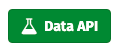
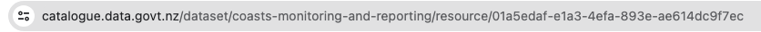

<!-- README.md is generated from README.Rmd. Please edit that file -->

# nzdata

<!-- badges: start -->

[](https://lifecycle.r-lib.org/articles/stages.html#stable)
<!-- badges: end -->

nzdata is an API wrapper for data.govt.nz

## Installation

You can install the development version of nzdata from
[GitHub](https://github.com/) with:

``` r
# install.packages("devtools")
devtools::install_github("courtneyruss/nzdata")
```

## Caveat

get_nz_data() will only work with resources that are ‘machine readable’.
These are marked with this icon: 

## Useage

This example requests data from dataset [“A-Z listing of all Whanganui
streets”](https://catalogue.data.govt.nz/dataset/whanganui-streets-a-z/resource/2f4e30a7-091f-4aed-b18f-4b21cc19e6b4)

To find the resource ID, navigate to the resource page on
catalogue.data.govt.nz. The resource ID is the string after the last
backslash:

<figure>

<figcaption aria-hidden="true">URL Path</figcaption>
</figure>

``` r
library(nzdata)
streets <- get_nz_data('2f4e30a7-091f-4aed-b18f-4b21cc19e6b4')
head(streets, 10)
#>    _id          Abbot St
#> 1    1          Acton Pl
#> 2    2   Addenbrooke Tce
#> 3    3 Ahu Ahu Valley Rd
#> 4    4          Aiken Rd
#> 5    5        Airport Rd
#> 6    6        Akapuka Rd
#> 7    7         Akatea St
#> 8    8        Akepiro Pl
#> 9    9          Alexa Pl
#> 10  10      Alexander St

schools <- nz_dataset_metadata('directory-of-educational-institutions')

schools$author
#> $author
#> [1] "Ministry of Education"
schools$frequency_of_update
#> $frequency_of_update
#> [1] "Continuously updated"
schools$metadata_modified
#> $metadata_modified
#> [1] "2024-02-27T20:34:29.764812"
```
